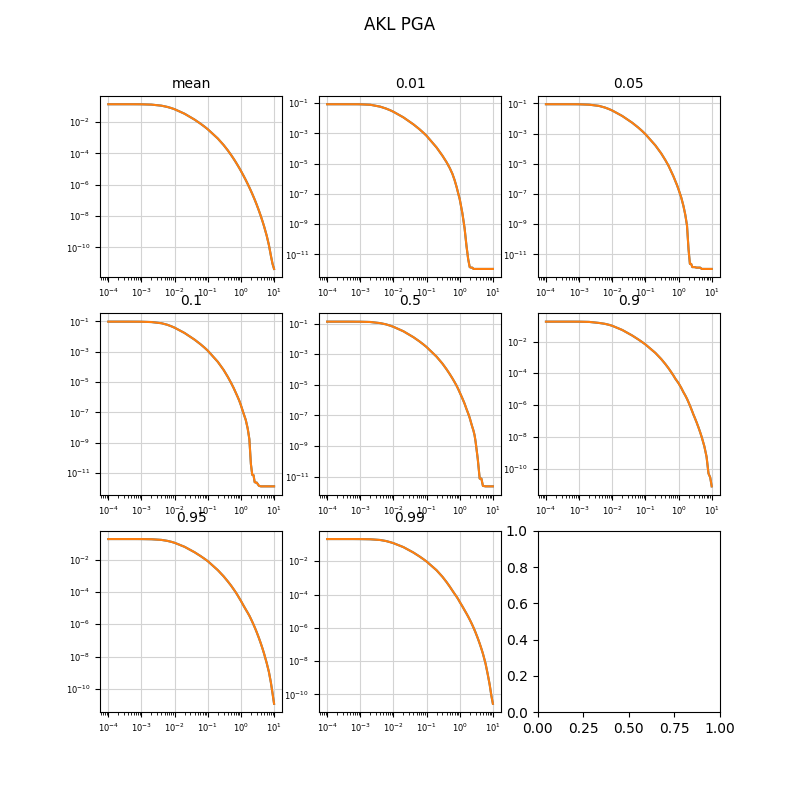

# toshi-hazard-post testing
Difference between NZ NSHM 2022 hazard curves as published and calculated using new toshi-hazard-post on 21/03/2025 (commit hash d2b29ac). Difference curves are the absolute value of the difference in probability. Relative difference curves are abs val difference divided by the published curves. Location srg_120 is the SRWG Masterton site.
## srg_120

.png)

.png)

.png)

.png)

.png)

.png)

.png)

.png)

.png)

## DUD

.png)

.png)

.png)

.png)

.png)

.png)

.png)

.png)

.png)

## CHC

.png)

.png)

.png)

.png)

.png)

.png)

.png)

.png)

.png)

## AKL

.png)

.png)

.png)

.png)

.png)

.png)

.png)

.png)

.png)

